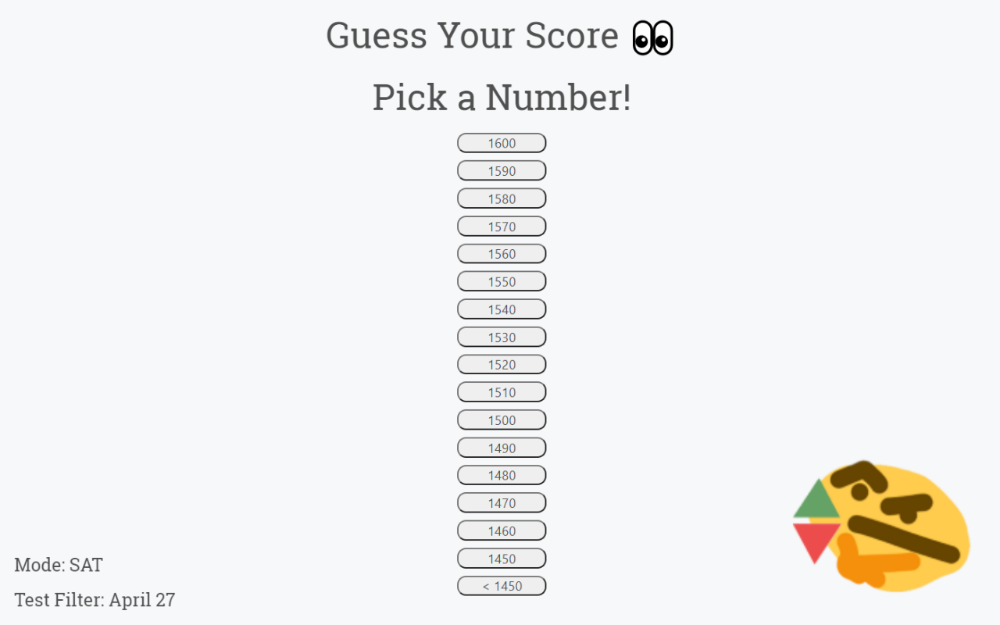
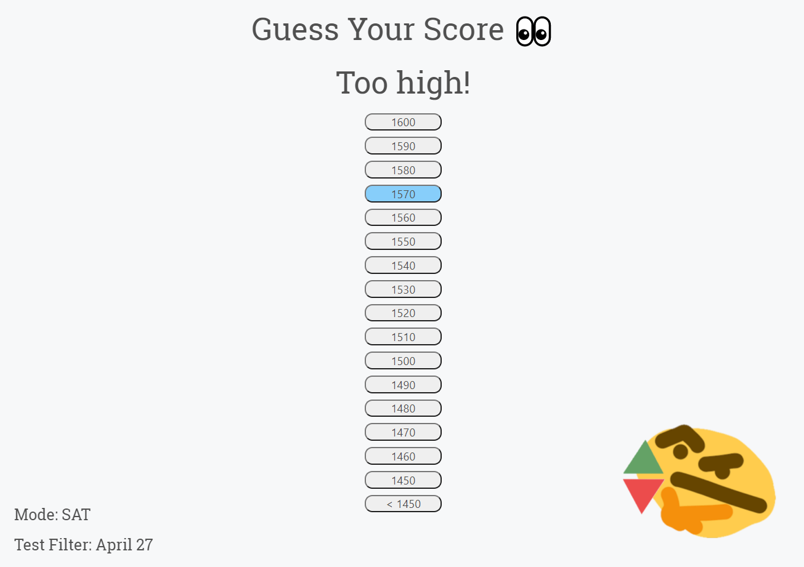
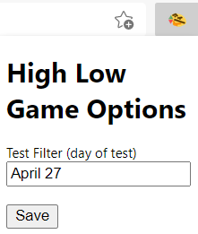

# Score Guessing Game
A chrome extension that allows you to guess your standardized test score before you see it!
For now only the SAT is supported, but AP support is coming soon!

How to use:
1. Click on the extension's icon on your browser's toolbar (this will bring up the options menu)
2. For the test filter field, enter the date of your SAT in the format \[month] \[day] (this tells the extension which test to look for)
3. Navigate to https://studentscores.collegeboard.org/viewscore
4. After you sign in/the page loads, the game should appear
5. Try to guess your score!
6. Once you guess it, the game should disappear

