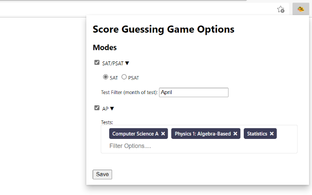
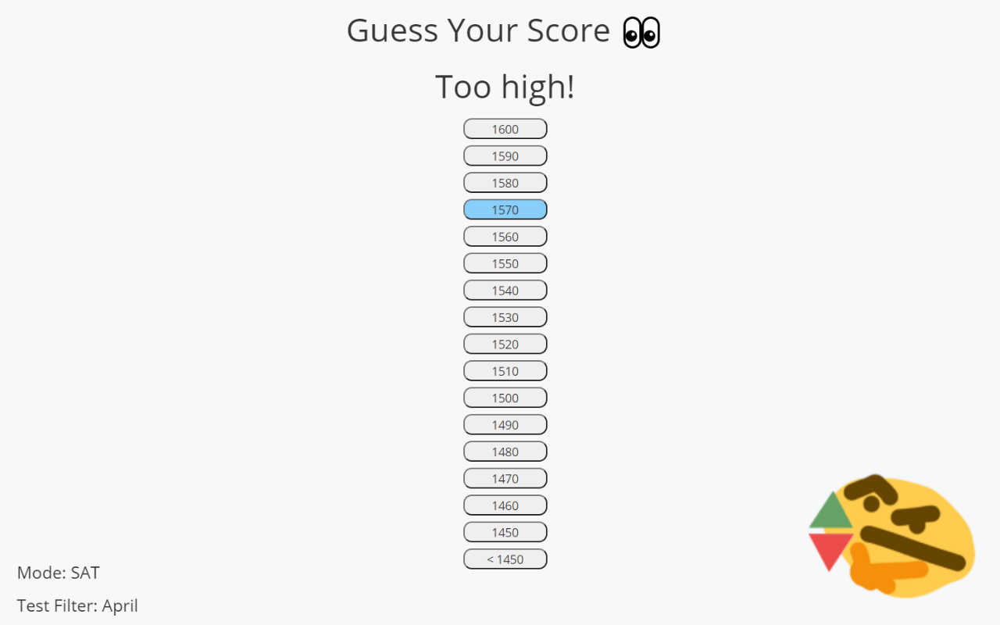
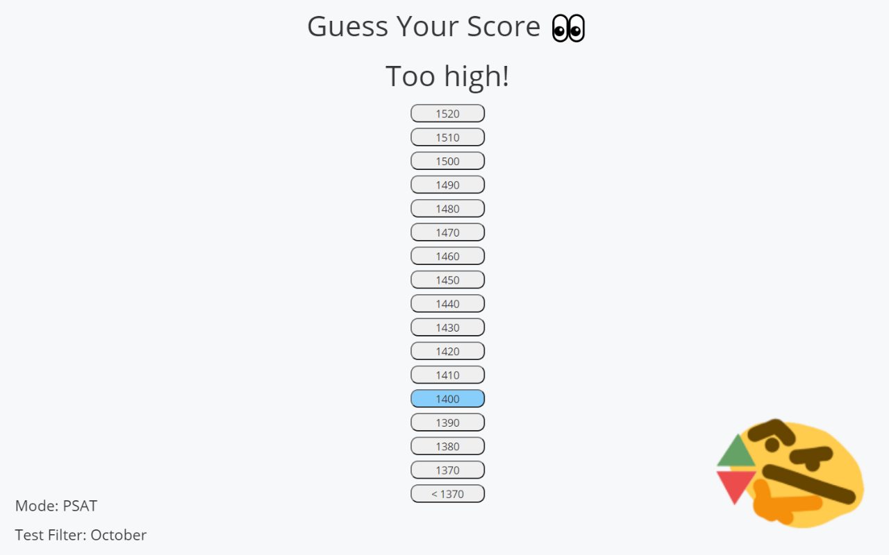
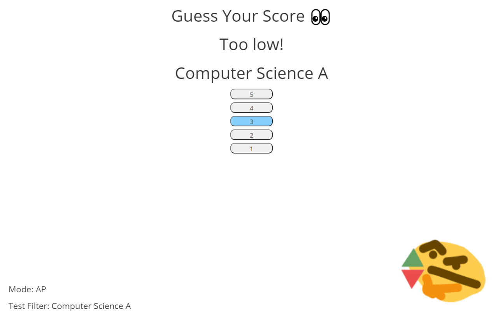

# Score Guessing Game
A Chrome extension that allows you to guess your SAT/PSAT and AP test score before you see it!

## How to use:

### SAT/PSAT
1. Click on the extension's icon on your browser's toolbar to bring up the options menu
2. Click on the arrow next to SAT/PSAT
3. For PSAT, make sure you select the correct bubble
4. For the test filter field, enter the month you took your SAT/PSAT (this tells the extension which test to look for) and click save
5. Navigate to https://studentscores.collegeboard.org/viewscore
6. After you sign in/the page loads, the game should appear
7. Try to guess your score!
8. Once you guess it, the game disappears to show the original website

### AP
1. Click on the extension's icon on your browser's toolbar
2. Click on the arrow next to AP
3. In the tests field, enter the names of the AP test you took. Autocomplete is available, and you can also scroll through the list to find the tests you want to add. Click the save button at the bottom when you are done.
4. Navigate to https://apstudents.collegeboard.org/view-scores
5. After you sign in/the page loads, the game should appear
6. Try to guess your score(s)!
7. Once you finish, the game disappears to show the original website

### Other Info

Note: If you ever want to disable the game for one of the tests, uncheck the box next to it in the options menu.

For any bugs or feature requests, do not hesitate to email appdev.micro@gmail.com or open an issue on GitHub.

Privacy Note: None your test scores are stored by the extension after you close the tab containing your test scores (since the variables in the extension script are destroyed). The extension stores user options in the local storage of your browser.

